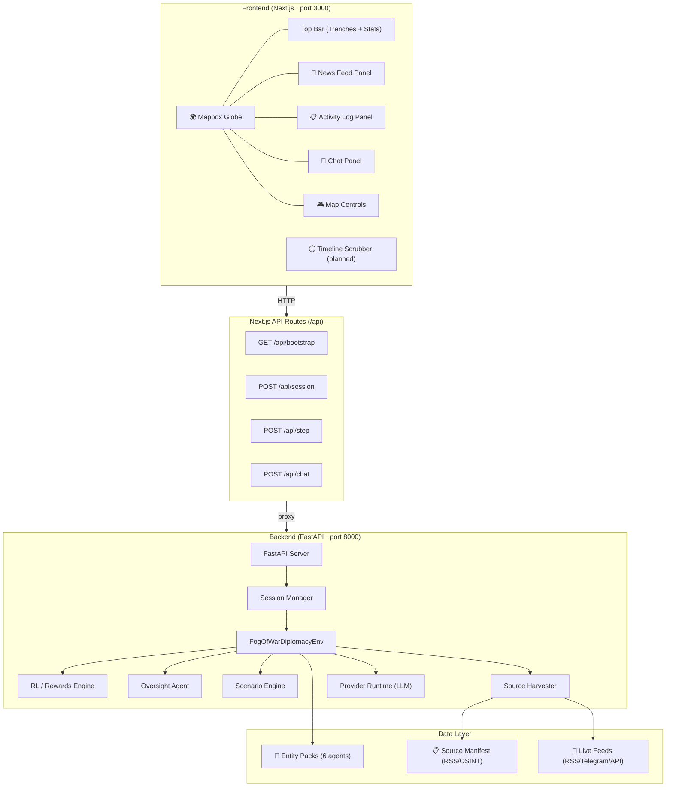
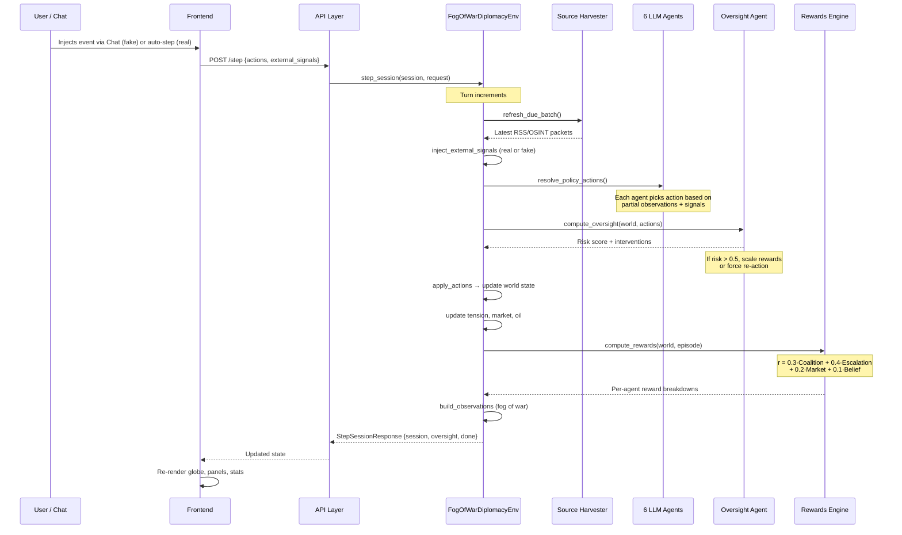
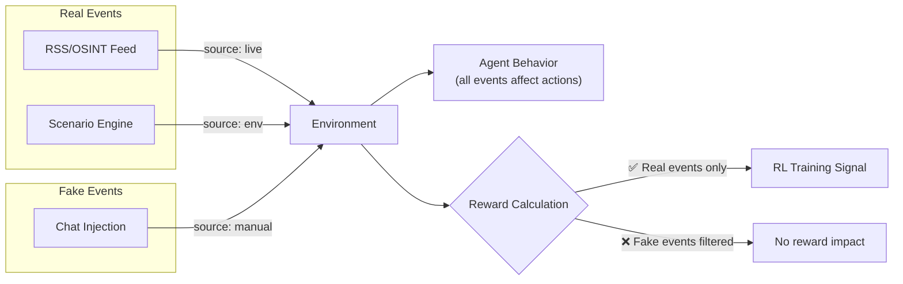
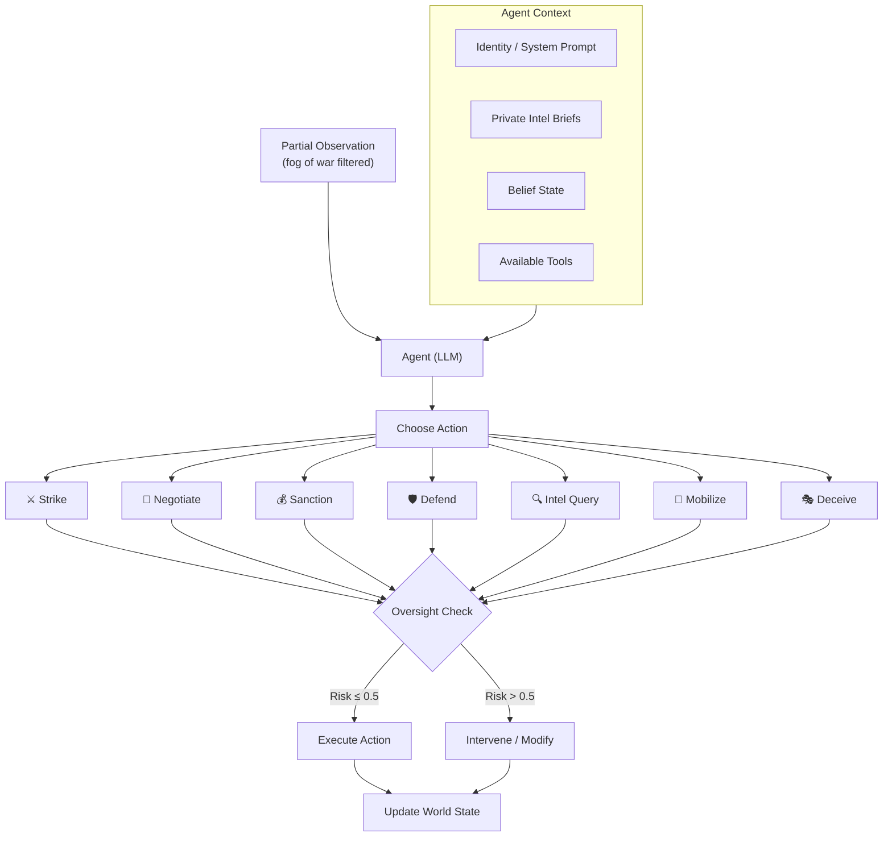

# Trenches — System Flow

## High-Level Architecture

```mermaid
graph TB
    subgraph Frontend ["Frontend (Next.js · port 3000)"]
        Globe["🌍 Mapbox Globe"]
        TopBar["Top Bar (Trenches + Stats)"]
        News["📰 News Feed Panel"]
        Activity["📋 Activity Log Panel"]
        Chat["💬 Chat Panel"]
        Controls["🎮 Map Controls"]
        Timeline["⏱️ Timeline Scrubber (planned)"]
    end

    subgraph API ["Next.js API Routes (/api)"]
        Bootstrap["GET /api/bootstrap"]
        SessionAPI["POST /api/session"]
        StepAPI["POST /api/step"]
        ChatAPI["POST /api/chat"]
    end

    subgraph Backend ["Backend (FastAPI · port 8000)"]
        Server["FastAPI Server"]
        Env["FogOfWarDiplomacyEnv"]
        SessionMgr["Session Manager"]
        RL["RL / Rewards Engine"]
        Oversight["Oversight Agent"]
        Scenarios["Scenario Engine"]
        SourceHarvester["Source Harvester"]
        ProviderRuntime["Provider Runtime (LLM)"]
    end

    subgraph Data ["Data Layer"]
        Entities["📁 Entity Packs (6 agents)"]
        SourceManifest["📋 Source Manifest (RSS/OSINT)"]
        LiveFeeds["🔴 Live Feeds (RSS/Telegram/API)"]
    end

    Globe --- TopBar
    Globe --- News
    Globe --- Activity
    Globe --- Chat
    Globe --- Controls

    Frontend -->|HTTP| API
    API -->|proxy| Backend

    Server --> SessionMgr
    SessionMgr --> Env
    Env --> RL
    Env --> Oversight
    Env --> Scenarios
    Env --> SourceHarvester
    Env --> ProviderRuntime

    SourceHarvester --> LiveFeeds
    SourceHarvester --> SourceManifest
    Env --> Entities
```

## Simulation Loop (per turn)

```mermaid
sequenceDiagram
    participant User as User / Chat
    participant FE as Frontend
    participant API as API Layer
    participant Env as FogOfWarDiplomacyEnv
    participant Sources as Source Harvester
    participant Agents as 6 LLM Agents
    participant OA as Oversight Agent
    participant RL as Rewards Engine

    User->>FE: Injects event via Chat (fake) or auto-step (real)
    FE->>API: POST /step {actions, external_signals}
    API->>Env: step_session(session, request)

    Note over Env: Turn increments

    Env->>Sources: refresh_due_batch()
    Sources-->>Env: Latest RSS/OSINT packets

    Env->>Env: inject_external_signals (real or fake)

    Env->>Agents: resolve_policy_actions()
    Note over Agents: Each agent picks action based on<br/>partial observations + signals

    Env->>OA: compute_oversight(world, actions)
    OA-->>Env: Risk score + interventions
    Note over OA: If risk > 0.5, scale rewards<br/>or force re-action

    Env->>Env: apply_actions → update world state
    Env->>Env: update tension, market, oil

    Env->>RL: compute_rewards(world, episode)
    Note over RL: r = 0.3·Coalition + 0.4·Escalation<br/>+ 0.2·Market + 0.1·Belief
    RL-->>Env: Per-agent reward breakdowns

    Env->>Env: build_observations (fog of war)
    Env-->>API: StepSessionResponse {session, oversight, done}
    API-->>FE: Updated state
    FE->>FE: Re-render globe, panels, stats
```

## Event Types and Reward Impact

```mermaid
flowchart LR
    subgraph Real ["Real Events"]
        RSS["RSS/OSINT Feed"]
        Scenario["Scenario Engine"]
    end

    subgraph Fake ["Fake Events"]
        ChatInput["Chat Injection"]
    end

    RSS -->|"source: live"| Env["Environment"]
    Scenario -->|"source: env"| Env
    ChatInput -->|"source: manual"| Env

    Env --> AgentBehavior["Agent Behavior<br/>(all events affect actions)"]

    Env --> RewardCalc{"Reward Calculation"}

    RewardCalc -->|"✅ Real events only"| RLSignal["RL Training Signal"]
    RewardCalc -->|"❌ Fake events filtered"| NoReward["No reward impact"]
```

## Agent Decision Flow

```mermaid
flowchart TD
    Obs["Partial Observation<br/>(fog of war filtered)"] --> Agent["Agent (LLM)"]

    subgraph Context ["Agent Context"]
        Identity["Identity / System Prompt"]
        Intel["Private Intel Briefs"]
        Beliefs["Belief State"]
        Tools["Available Tools"]
    end

    Context --> Agent

    Agent --> Action["Choose Action"]
    Action --> Strike["⚔️ Strike"]
    Action --> Negotiate["🤝 Negotiate"]
    Action --> Sanction["💰 Sanction"]
    Action --> Defend["🛡️ Defend"]
    Action --> Intel2["🔍 Intel Query"]
    Action --> Mobilize["🚀 Mobilize"]
    Action --> Deceive["🎭 Deceive"]

    Strike & Negotiate & Sanction & Defend & Intel2 & Mobilize & Deceive --> Oversight{"Oversight Check"}

    Oversight -->|"Risk ≤ 0.5"| Execute["Execute Action"]
    Oversight -->|"Risk > 0.5"| Intervene["Intervene / Modify"]

    Execute --> WorldUpdate["Update World State"]
    Intervene --> WorldUpdate
```
