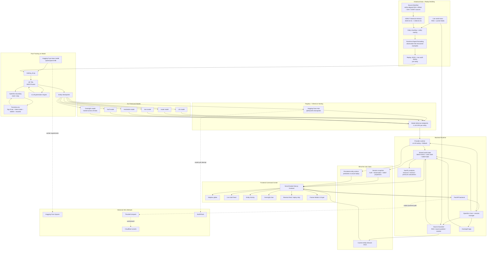

# Trenches Master Mermaid

This file contains one master Mermaid visual that explains the full Trenches technical design across:

- historical data collection
- replay building
- post-training
- model registry and serving
- backend orchestration
- frontend operator experience

## Reading Guide

- Left side: where training data came from and how it was shaped.
- Center: how `HF TRL + OpenEnv + vLLM` produced six separate finetuned models on Modal.
- Right side: how those models are served back into the live FastAPI simulation runtime.
- Bottom: how the Vercel frontend turns backend state into the globe, feeds, entity activity, and replay surfaces.
- Dotted lines: infrastructure paths that were tried earlier but were not the final operating choice.
