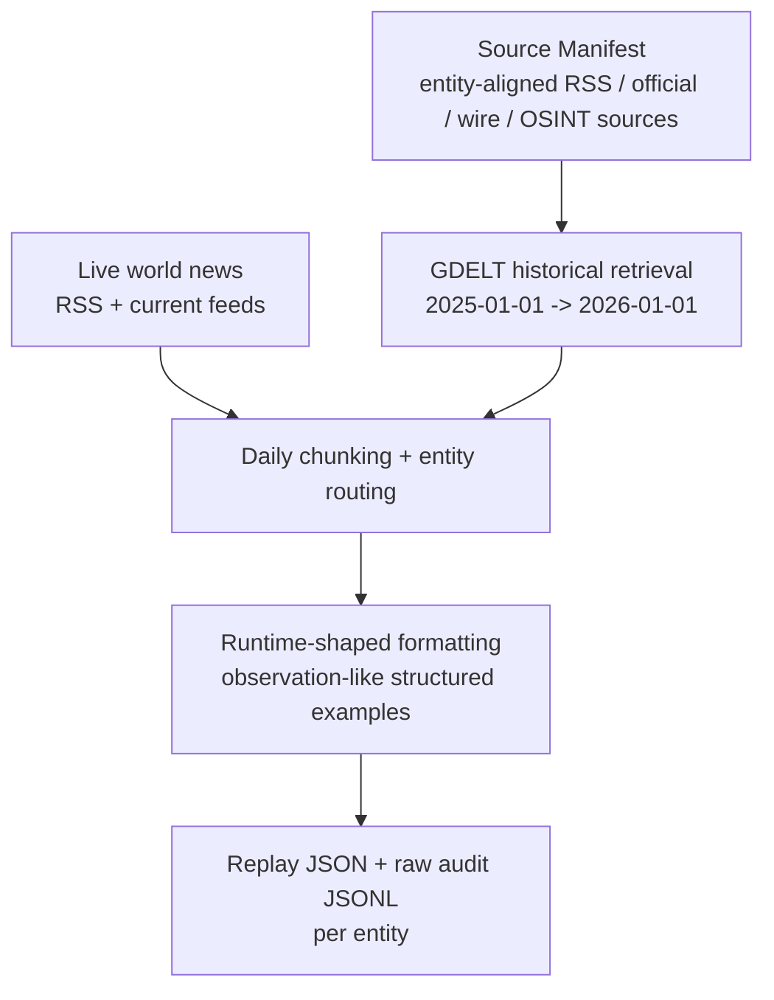
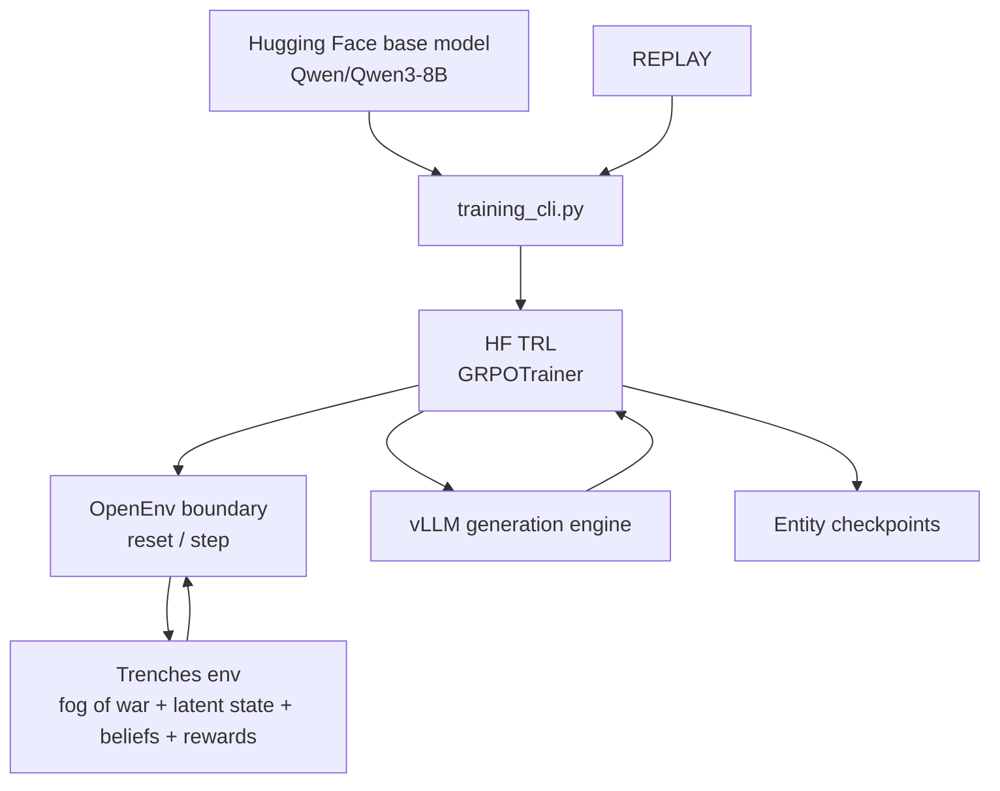
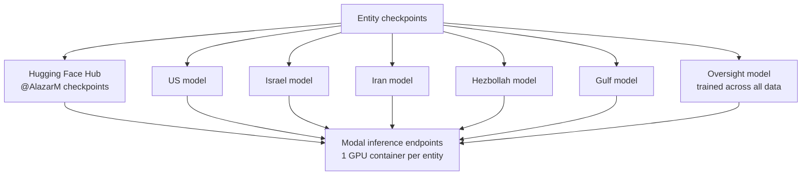
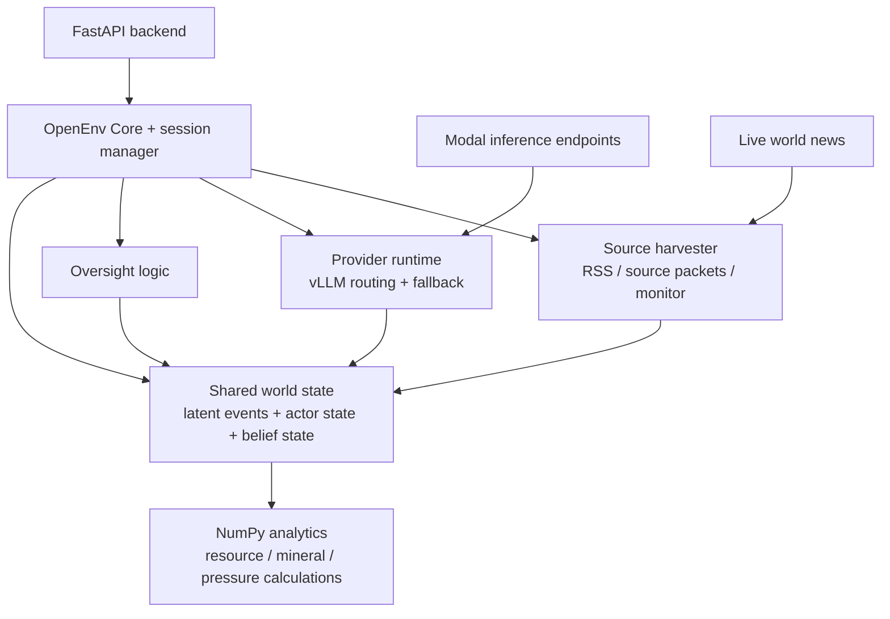
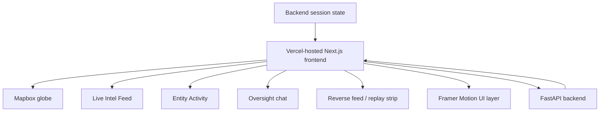
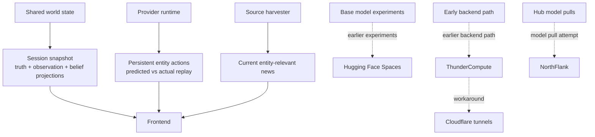

# Trenches Mermaid

This file keeps the architecture in one place, but breaks the Mermaid into smaller sections so it stays readable and renderable.

## 1. Historical Data + Replay Building

- `source_manifest.json` defines the entity-aligned source universe.
- Historical retrieval and live feeds are both routed into runtime-shaped replay examples.
- The replay output is the training input used downstream.

## 2. Post-Training on Modal

- Replays feed `training_cli.py`.
- `GRPOTrainer` uses the environment loop through the OpenEnv boundary.
- Training produces entity-specific checkpoints.

## 3. Model Registry + Inference Hosting

- Checkpoints are published to Hugging Face Hub.
- Modal exposes one inference endpoint per entity model.
- Oversight is separate from the five actor models.

## 4. Backend Runtime

- Session state lives in the backend runtime, not the frontend.
- Source harvesting and provider inference both feed the same world model.
- Oversight modifies or evaluates actions before the world advances.

## 5. Frontend Command Center

- The frontend is an operator surface over backend session state.
- Timeline, feeds, map, and chat are all different views over the same simulation.

## 6. User-Facing Outputs + Legacy Infra

- This section isolates the user-visible outputs from the historical infrastructure experiments.
- The dotted lines are explicitly non-final paths.

## Reading Order

- Start with historical data and replay building.
- Then read post-training and model serving.
- Then read backend runtime and frontend command center.
- Finish with user-facing outputs and the legacy infra notes.
