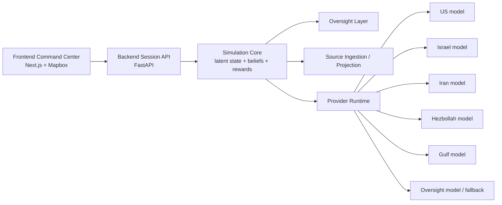
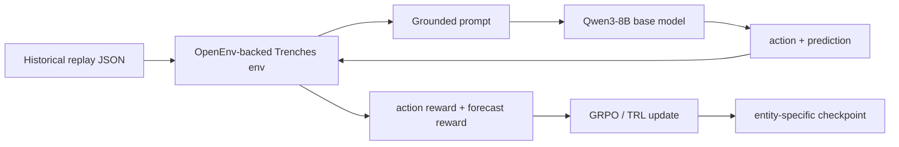
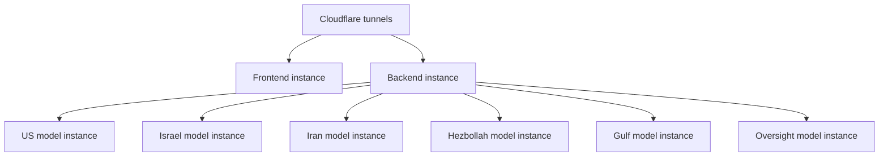

# Trenches Presentation

This document consolidates the checked-in project markdowns into one presentation-style spec for the Trenches platform. It also incorporates the checked-in deployment scripts under `backend/train_modal.py` and `ops/thunder/*.sh` where they clarify the actual training and serving path.

Important note on source fidelity:

- The markdowns fully document the simulator, data model, training loop, and provider abstraction.
- The repo also documents a Modal-based post-training path and a Thunder-oriented serving path in scripts.
- The exact `6 Thunder model instances + 1 backend instance + Cloudflare tunnel exposure` topology is not fully written down in the markdowns; that part is included here as the current operating model described in your request, with explicit callouts where the checked-in scripts differ.

## 1. What Trenches Is

Trenches is a multi-agent geopolitical crisis simulator built on top of OpenEnv. The product simulates a volatile 2026 Middle East escalation under fog of war. Six entity-specific language-model actors operate with partial information, role-specific incentives, and restricted tools, while an oversight layer monitors escalation risk and can intervene before the system runs away.

The core product idea is not "one generic war model." It is six doctrine-specific policies running inside one shared latent world:

- United States
- Israel
- Iran
- Hezbollah
- Gulf Coalition
- Oversight

Each actor is trained and prompted to behave like its own strategic entity, with its own:

- doctrine
- private briefings
- public briefings
- strategic metrics
- action priors
- data-source bundles
- replay data for post-training

That design decision is one of the main architectural bets in the project.

## 2. Product Spec

At the product level, Trenches is an operator console plus a simulation backend.

The user sees:

- a globe or theater map
- live news and reaction feeds
- recent entity actions
- a timeline and branch view for what-if exploration
- a chat panel for injected scenarios
- per-entity operational context

The backend manages:

- session creation and reset
- turn stepping
- fog-of-war observation projection
- latent event evolution
- entity belief state
- reward computation
- provider-backed model decisions with fallback
- scenario playback
- replay-compatible OpenEnv training

The product supports both:

- demo / operator mode
- training / replay mode

The key rule is that fake manual injections can influence behavior, but should not contaminate the training reward path.

## 3. Frontend Spec

The current frontend stack is Next.js 16 with React 19, Tailwind v4, Framer Motion, and Mapbox GL. The checked-in app entrypoint is `app/page.tsx`, which renders `src/components/GlobePage.tsx`.

The frontend acts as a command center, not a consumer-social dashboard. The intended UI language across the docs is tactical, dark, and operator-first:

- global theater map / globe
- top bar with simulation stats
- live news feed
- activity log
- chat panel
- event timeline
- simulation branch tree
- inter-agent tension matrix
- per-entity context panes

The frontend should render different layers differently:

- operator truth comes from `session.world`
- entity perspective comes from `session.observations[agent_id]`
- persistent memory comes from `session.belief_state[agent_id]`
- hidden simulation drivers come from `session.world.latent_events`

This distinction matters. The docs repeatedly warn that the frontend must not collapse truth, observation, and belief into one flat state model.

### Frontend Responsibilities

The frontend is responsible for:

- bootstrapping platform capabilities
- creating and resetting sessions
- stepping turns
- toggling live source mode
- showing provider readiness and health
- showing source health
- visualizing reactions to public news
- exposing simulation branches and replay inspection

### Frontend Runtime Flow

1. App boots and calls `/capabilities`.
2. App creates or resets a session.
3. Frontend renders the current `SessionState`.
4. User steps the simulation or injects signals.
5. Backend returns updated world state, reward state, oversight output, and reaction/action logs.
6. UI re-renders map, feeds, matrix, and per-agent panels.

## 4. Backend Spec

The backend is a FastAPI service that exposes both:

- a session-oriented API for the product UI
- a native OpenEnv-compatible environment boundary for post-training

This is the critical engineering split:

- product sessions use the richer FastAPI session API
- training uses the OpenEnv adapter and scalar reward boundary

### Main Backend Concepts

The backend tracks five state layers:

1. `world.latent_state`
   Canonical backend truth used for simulation and rewards.

2. `world.latent_events`
   Hidden event chain that drives the world.

3. `world.actor_state`
   Lagged or public-facing state projection.

4. `observations[agent_id]`
   What the specific entity sees this turn.

5. `belief_state[agent_id]`
   What the entity currently believes across turns.

This means Trenches is not just a "chat over feeds" system. It is a stateful simulator with:

- hidden truth
- projected observations
- persistent beliefs
- public narrative projection

### Core Session Endpoints

The product-facing backend exposes:

- `GET /healthz`
- `GET /capabilities`
- `POST /sessions`
- `POST /sessions/{session_id}/reset`
- `GET /sessions/{session_id}`
- `POST /sessions/{session_id}/step`
- `POST /sessions/{session_id}/news`
- `GET /sessions/{session_id}/reactions`
- `GET /sessions/{session_id}/providers/diagnostics`
- `POST /sessions/{session_id}/live`
- `POST /sessions/{session_id}/sources/refresh`
- `GET /sessions/{session_id}/sources/monitor`
- `GET /scenarios`
- `POST /benchmarks/run`

When `openenv-core` is installed, native OpenEnv is mounted at `/openenv`.

### Oversight

Oversight is treated as a first-class system feature. It is not just a UI badge.

It:

- scores escalation risk
- monitors action patterns
- can trigger interventions
- modifies the transition logic
- contributes an explicit oversight result to step responses

The docs describe belief-propagation-style risk logic and thresholded intervention behavior, with the main policy rule being: oversight changes the world transition, not just reward scaling in isolation.

## 5. Entity Design

The six entities are intentionally asymmetric.

| Entity | Core role | Core strategic focus |
| --- | --- | --- |
| US | Superpower / alliance manager | alliances, force projection, domestic support, shipping and market stability |
| Israel | Regional military actor | immediate threat detection, air defense, northern front readiness, rapid strike planning |
| Iran | Adversarial state actor | regime survival, proxy coordination, missile/drone retaliation, Hormuz leverage |
| Hezbollah | Non-state proxy actor | asymmetric pressure, survivability, rockets/drones/raids, Iranian dependency |
| Gulf Coalition | Economic and hedging bloc | oil exports, shipping continuity, investor confidence, selective alignment |
| Oversight | Meta-governance layer | escalation monitoring, signal fusion, intervention reasoning, autonomy balance |

This asymmetry shows up in:

- prompts
- source bundles
- action availability
- asset packs
- strategic metrics
- doctrine scores
- reward targets
- training replays

## 6. Data Sources and Data Organization

Trenches deliberately separates the source universe from the observation surface.

### Source Strategy

The project starts from a shared source manifest, then filters it into entity-specific bundles. This is the design answer to "vast data unique to their entities":

- there is one broad source universe
- each entity only receives its aligned slice
- the same external event can be projected differently to different entities

Planned and documented source categories include:

- Reuters and wire reporting
- official government and ministry sources
- regional English-language outlets
- sanctions, diplomacy, shipping, and market reporting
- ACLED conflict data
- GDELT event streams
- Polymarket-style political or market signals
- Telegram / OSINT channels
- webcams / streams / geospatial feeds
- Cloudflare Radar outage data in the ingestion layer

### Data Layers in the Product

The product organizes data into:

- source manifest
- source packets
- training source packets
- live source packets
- private briefs
- public briefs
- historical replay events
- latent events
- active public events
- action logs
- reaction logs
- belief memory

This layered structure is one of the strongest engineering decisions in the project. It keeps:

- ingestion
- simulation truth
- public narrative
- memory
- training data

separate enough to reason about.

### Historical Replay Data

The data path for post-training now supports real historical collection:

- start from `source_manifest.json`
- derive allowlisted historical domains
- query GDELT month by month
- write raw article audit JSONL
- convert articles into replay JSON
- curator-review before production use

Replay JSON uses the same schema the trainer already consumes:

- `replay_id`
- `name`
- `description`
- `training_agent`
- `events[]`

Each event includes:

- `event_id`
- `timestamp`
- `topic`
- `region`
- `actors`
- `targets`
- `severity`
- `summary`
- `public_summary`
- `source_type`
- `confirmed`
- `tags`
- `impact`

This is important: the project moved from synthetic-only seed replay data toward a real historical collection pipeline, but the docs are explicit that the generated replay still needs curator review because topic, severity, actor/target inference, and impact shaping still contain heuristics.

## 7. How the Simulator Works

At runtime, one turn looks like this:

1. Session turn increments.
2. Backend refreshes live sources if needed.
3. External signals are injected.
4. Each entity receives only its projected observation.
5. Each entity chooses an action, via provider inference or heuristic fallback.
6. Oversight computes risk and may intervene.
7. Backend applies actions to latent state.
8. Rewards are computed.
9. New observations are projected back out under fog of war.
10. Frontend receives the updated session state.

### Actions

Common actions across entities include:

- hold
- negotiate
- sanction
- strike
- defend
- intel query
- mobilize
- deceive

Oversight has its own review/intervention path.

### Tools

The tool model is function-calling oriented. Tools are not global superpowers. They are filtered by role and permissions.

Examples:

- `query_intel`
- `analyze_belief`
- `propose_negotiation`
- US sanctions / deployment tools
- Israeli strike / defense tools
- Iranian proxy / Hormuz tools
- Hezbollah swarm / evasion tools
- Gulf market / base access tools
- Oversight explanation / risk / intervention tools

The intended behavior is:

- tool calls are parsed from model output
- permissions are validated server-side
- results are fed back into the next observation
- overuse can be penalized or rate-limited

## 8. Reward and Learning Spec

The reward system is not generic. It is doctrine-shaped.

At a high level, reward combines:

- coalition stability
- escalation penalty
- market or economic pressure
- behavioral consistency / doctrine adherence
- forecast accuracy during replay training

The project docs started from a shared multi-term formula, but later work moved toward more differentiated per-entity strategic baselines and action effects.

That means the US is not scored like Hezbollah, and the Gulf is not scored like Iran.

### Entity-Specific Strategic Metrics

Examples documented in the training/data flow:

- US: `regional_access`, `shipping_security`, `domestic_support`, `force_posture`
- Israel: `homeland_security`, `northern_deterrence`, `us_resupply_confidence`, `reserve_endurance`
- Iran: `regime_stability`, `proxy_corridor`, `hormuz_leverage`, `deterrence_credibility`
- Hezbollah: `launch_survivability`, `logistics_depth`, `resistance_credibility`, `political_cover`
- Gulf: `shipping_continuity`, `investor_confidence`, `infrastructure_security`, `diplomatic_flexibility`
- Oversight: `runaway_risk`, `autonomy_balance`, `intervention_legitimacy`, `trace_clarity`

### Forecasting Reward

Replay training adds a second job for the model:

- choose an action
- predict what will happen next

Predictions are then scored against the next revealed historical event on:

- topic
- actor
- target
- timing
- severity
- confidence calibration

This turns post-training into more than action imitation. The model is rewarded for anticipating the next turn of the crisis.

## 9. Fine-Tuning and Post-Training

The fine-tuning strategy is one of the strongest parts of the repo.

### Core Training Decision

The chosen base model is:

- `Qwen/Qwen3-8B`

Why it was selected:

- fits the target post-training window
- available on Hugging Face
- strong enough for structured action + prediction output
- feasible to train separately for all six entities

### Training Architecture

The implemented training flow is:

1. `training_cli.py` starts the environment path.
2. A replay is loaded for the selected entity.
3. An observation is rendered into a grounded prompt.
4. The model generates multiple completions.
5. Output is parsed into:
   - `action`
   - `prediction`
6. The environment steps once.
7. Action reward and forecast reward are computed.
8. GRPO updates the policy.
9. A checkpoint is saved.

### Training Method

The docs consistently position the current post-training loop as:

- OpenEnv environment boundary
- Hugging Face TRL training stack
- GRPO optimization
- one model per entity

The model is not trained as one monolithic policy across all actors. The design is:

- six separate post-training jobs
- six separate checkpoints
- six separate entity identities

### Six Fine-Tuned Models

The project plans and scripts converge on six entity-specific checkpoints:

- `trenches-us-qwen3-8b`
- `trenches-israel-qwen3-8b`
- `trenches-iran-qwen3-8b`
- `trenches-hezbollah-qwen3-8b`
- `trenches-gulf-qwen3-8b`
- `trenches-oversight-qwen3-8b`

The docs also include:

- local smoke tests with `tiny-gpt2`
- a Hugging Face T4 smoke test
- a plan for larger parallelized GPU training

## 10. Infrastructure Evolution

The infrastructure story appears in three phases.

### Phase 1: Local and Hugging Face Proofs

The early documented path used:

- local `transformers` generation for smoke tests
- Hugging Face-hosted experiments
- a Hugging Face T4 smoke run
- a planned Hugging Face A100-space scale-up

This phase proved:

- the replay-aware training loop worked
- the environment and trainer boundary worked
- the model could emit structured action + prediction outputs

### Phase 2: Modal for Parallel GPU Training

The repo then adds a much stronger post-training plan around Modal.

That Modal plan is explicit:

- one parallel training job per entity
- vLLM in server mode
- GRPO via TRL
- full-precision Qwen3-8B
- dedicated GPU separation between inference and training in the original plan

The markdown plan describes:

- 6 parallel Modal containers
- A100 80GB x2 per entity in the initial written plan
- around one hour of wall-clock training
- six output checkpoints

The checked-in `backend/train_modal.py` later uses Modal with `H200:2` fallback configuration and automates:

- entity-specific replay selection
- vLLM server startup
- replay-aware training CLI execution
- checkpoint storage in a Modal volume

This is the clearest documented transition from prototype training to serious parallel post-training.

### Phase 3: Thunder Compute for Serving

The repo also contains Thunder-oriented deployment scripts:

- `ops/thunder/deploy_trenches_vllm.sh`
- `ops/thunder/deploy_trenches_app_container.sh`

These scripts show the final serving pattern:

- self-hosted vLLM model endpoints
- app container with frontend + backend integration
- model-provider bindings pointed at local OpenAI-compatible `/v1` endpoints

In your deployment history, this is the point where the project moved from Hugging Face-centric experimentation to Modal for training, then to Thunder Compute for serving because the desired GPU supply was not available where you first wanted to run it.

That migration makes engineering sense:

- Hugging Face was good for proof and smoke tests
- Modal was good for parallel post-training
- Thunder Compute was good for controlled self-hosted serving of the finetuned checkpoints

## 11. Provider Switching and Runtime Abstraction

A major engineering choice in the backend is the provider abstraction layer.

The backend supports:

- `openai`
- `anthropic`
- `openrouter`
- `huggingface`
- `ollama`
- `vllm`
- `custom`

Per-entity provider bindings are configured independently with environment variables. That means the simulator can run mixed topologies, for example:

- one entity on a hosted API
- another on local vLLM
- another still on heuristic fallback

### Runtime Behavior

For each entity:

1. backend checks whether the provider binding is configured and ready
2. if ready, it attempts provider inference
3. if inference fails or returns invalid output, it falls back to heuristic policy
4. diagnostics are recorded
5. action metadata records whether the action came from:
   - `provider_inference`
   - `heuristic_fallback`

This is important operationally. The product does not pretend a model is live when it is not.

### Hugging Face Provider Mode

When using the `huggingface` provider:

- the backend uses the HF router chat-completions endpoint
- `HF_TOKEN` is the default secret env var if no override is set
- optional routing policies can bias model routing

### vLLM Provider Mode

When using `vllm`:

- the backend talks to OpenAI-compatible local endpoints
- each entity can point to a different local URL
- this is the mechanism used by the Thunder serving path

## 12. Serving Topology

This section combines the checked-in Thunder scripts with the current operating model from your request.

### Intended Production Shape

Target operating layout:

- 6 Thunder Compute instances for the six finetuned entity models
- 1 Thunder Compute instance for the app/backend runtime
- Cloudflare tunnels exposing the frontend and backend session surfaces
- backend routing entity decisions to the six model endpoints

In that topology:

- each entity gets a dedicated serving endpoint
- the backend remains the orchestrator and source of session truth
- the frontend never talks directly to the models
- the public internet sees the Cloudflare-exposed frontend and API, not the private model ports

### What the Checked-In Thunder Scripts Prove

The checked-in scripts already prove the architectural shape, even though they do not fully encode the exact `6 + 1` deployment narrative:

- app container expects backend on `127.0.0.1:8000`
- frontend runs on `7860`
- backend provider bindings point to local vLLM endpoints
- model endpoints are OpenAI-compatible
- ports `8101` to `8105` are assigned per entity in the current script

Current scripted mappings:

- US -> `8101`
- Hezbollah -> `8102`
- Gulf -> `8103`
- Israel -> `8104`
- Iran -> `8105`

Important current gap:

- the checked-in Thunder app script currently sets `TRENCHES_MODEL_PROVIDER_OVERSIGHT="none"`
- the checked-in vLLM script currently does not boot an oversight endpoint

So the repo supports the story "six models were fine-tuned," but the checked-in Thunder serving scripts currently wire five live vLLM entity endpoints plus the app/backend container. The sixth oversight serving endpoint is still a deployment gap relative to the full intended topology.

### Cloudflare Exposure Model

Based on your current deployment description, Cloudflare tunneling sits in front of:

- the frontend experience
- the backend session API

The clean engineering model is:

- keep model ports private to the Thunder network
- expose only the frontend and backend through Cloudflare
- let the backend own all session state, provider routing, and inference telemetry

That is the correct separation for security and control.

## 13. End-to-End Product Flow

From a user and operator perspective, the platform works like this:

1. User opens the Cloudflare-exposed frontend.
2. Frontend creates a session against the backend.
3. Backend initializes world state, latent events, belief state, and source projections.
4. Frontend shows the command map, feeds, and entity panels.
5. A step or news injection triggers entity decisions.
6. Backend routes those decisions to live model providers or heuristic fallback.
7. Oversight scores risk and may intervene.
8. Backend updates the latent world.
9. Backend returns the new session snapshot.
10. Frontend re-renders the operator console.

In training mode, the flow is similar but the loop uses replay data and GRPO rather than user-driven session control.

## 14. Why the Engineering Design Is Good

Several design decisions are unusually strong:

- one shared latent world, many projected realities
- entity-specific models instead of one generic policy
- persistent belief memory, not just single-turn prompts
- explicit split between live/demo mode and reproducible replay training
- provider abstraction with explicit fallback and diagnostics
- replay-aware forecasting reward, not just action scoring
- source manifest reuse across live data and historical collection
- clean OpenEnv boundary for training without forcing the product API to look like the trainer

This gives the system three things at once:

- a credible demo surface
- a real engineering substrate for post-training
- a path from prototype to production inference

## 15. Risks, Gaps, and Honest Status

The repo is strong, but the docs are clear about what still needs work.

Main remaining gaps:

- persistent replay and durable event history
- deeper latent event causality and spillover modeling
- richer evaluation and benchmark reporting
- full curated historical truth sets across all entities
- final wiring for all tool packs into observations
- stronger provider retry taxonomy and diagnostics
- full oversight model serving in the Thunder path

Also worth noting:

- some markdowns describe older frontend structure, while the current checked-in frontend is Next.js 16
- some training docs still speak in terms of synthetic seed data even though real historical replay collection now exists

That is normal for a fast-moving repo, but it is worth saying explicitly in a presentation.

## 16. Source Basis

This presentation is grounded primarily in:

- `README.md`
- `PLAN.md`
- `FLOW.md`
- `DATA.md`
- `ENTITIES.md`
- `RL.md`
- `TRAINING_PLAN.md`
- `BACKEND_SUMMARY.md`
- `HANDOFF.md`
- `IMPROVEMENTS.md`
- `TODO.md`
- `TOOLS.md`
- `backend/README.md`
- `backend/TRAINING_FLOW.md`
- `backend/HOW_POST_TRAINING_WORKS.md`
- `backend/TRAINING_RUNBOOK.md`
- `backend/POST_TRAINING_PLAN.md`
- `backend/POST_TRAINING_DATA_FLOW.md`
- `entities/*/README.md`

Supplemental implementation references used to reconcile deployment/training details:

- `backend/train_modal.py`
- `ops/thunder/deploy_trenches_vllm.sh`
- `ops/thunder/deploy_trenches_app_container.sh`
