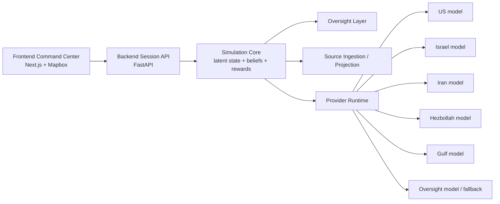
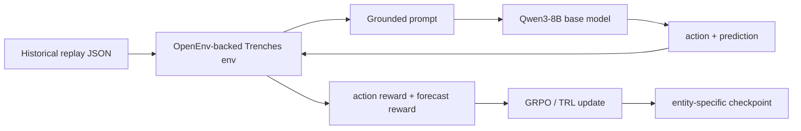
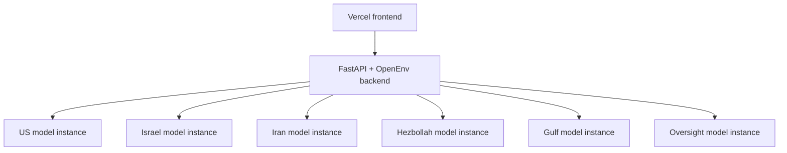

# Trenches Presentation

This document consolidates the checked-in project markdowns into one presentation-style spec for the Trenches platform. It also incorporates the checked-in deployment scripts under `backend/train_modal.py`, the older `ops/thunder/*.sh` scripts where they clarify infrastructure evolution, and direct operator history about how the system was actually trained, hosted, and iterated in practice.

Important note on source fidelity:

- The markdowns document the simulator, data model, training loop, and runtime abstraction.
- The actual infrastructure story changed repeatedly during development: Hugging Face, Thunder Compute, Cloudflare tunnels, NorthFlank, and Modal were all tried at different phases before settling on the current stack.
- Where the repo and the lived deployment history differ, this presentation prioritizes the real operating history.

## 1. What Trenches Is

Trenches is a multi-agent geopolitical crisis simulator built on top of OpenEnv. The product simulates a volatile 2026 Middle East escalation under fog of war. Six entity-specific language-model actors operate with partial information, role-specific incentives, and restricted tools, while an oversight layer monitors escalation risk and can intervene before the system runs away.

The core product idea is not "one generic war model." It is six doctrine-specific policies running inside one shared latent world:

- United States
- Israel
- Iran
- Hezbollah
- Gulf Coalition
- Oversight

Each actor is trained and prompted to behave like its own strategic entity, with its own:

- doctrine
- private briefings
- public briefings
- strategic metrics
- action priors
- data-source bundles
- replay data for post-training

That design decision is one of the main architectural bets in the project.

## 2. Product Spec

At the product level, Trenches is an operator console plus a simulation backend.

The user sees:

- a full-screen rotating Mapbox globe with fog-of-war styling
- a top status bar with turn count, live simulation metrics, and map controls
- a left "Live Intel Feed" sourced from RSS bootstrap items, source packets, events, and public briefs
- a right "Entity Activity" ledger sourced from backend step traces and rewards
- a bottom reverse feed / replay surface for playback, event inspection, predicted-vs-actual action review, and provider-source-action tracing
- an oversight chat panel that can discuss unfolding events, answer state questions, and inject synthetic events with `/inject`
- a selected-entity context card pinned over the globe when an actor is clicked

The backend manages:

- session creation and reset
- turn stepping
- fog-of-war observation projection
- latent event evolution
- entity belief state
- reward computation
- provider-backed model decisions with fallback
- scenario playback
- replay-compatible OpenEnv training

The product supports both:

- demo / operator mode
- training / replay mode

The key rule is that fake manual injections can influence behavior, but should not contaminate the training reward path.

Every entity is also grounded visually:

- each nation or actor has a capital marker
- each nation or actor has military bases and military assets on the map
- entity actions are replayed persistently in the visual layer rather than disappearing after one turn

## 3. Frontend Spec

The current frontend stack is Next.js 16 with React 19, Tailwind v4, Framer Motion, and Mapbox GL. The checked-in app entrypoint is `app/page.tsx`, which renders `src/components/GlobePage.tsx`. In the intended operating setup, the frontend is hosted on Vercel while the simulation backend runs separately.

The frontend acts as a command center, not a consumer-social dashboard. The intended UI language across the docs is tactical, dark, and operator-first:

- globe-first theater view with animated entity markers and highlighted borders
- top bar with turn, risk, market, resource-pressure, and map controls
- live intel feed with hydration status and per-entity filters
- entity activity ledger with action type, target, reward, and oversight markers
- chat panel for oversight queries and synthetic event injection
- reverse feed / timeline with timeline mode and console mode so operators can compare live action, predicted action, and actual outcome
- selected-entity context panel with current observation summary and latest actions

The frontend should render different layers differently:

- operator truth comes from `session.world`
- entity perspective comes from `session.observations[agent_id]`
- persistent memory comes from `session.belief_state[agent_id]`
- hidden simulation drivers come from `session.world.latent_events`

This distinction matters. The docs repeatedly warn that the frontend must not collapse truth, observation, and belief into one flat state model.

### Frontend Responsibilities

The frontend is responsible for:

- bootstrapping platform capabilities
- creating and resetting sessions
- stepping turns
- toggling live source mode
- rendering source-derived intel and action traces from live session state
- exposing timeline playback and console inspection
- supporting synthetic scenario injection through the oversight chat surface
- keeping the globe, side rails, and timeline in sync with the active or rewound turn

Presentation-wise, the frontend is meant to feel like a live command system rather than a static dashboard:

- RSS feeds are surfaced as current world news for the relevant entities
- persistent action replays stay visible below the main globe
- Framer Motion is used to keep the globe, side rails, and feed transitions feeling live without turning the UI into a toy

### Frontend Runtime Flow

1. App boots and calls `/capabilities`.
2. App creates a session and immediately enables live mode with `auto_step`.
3. Frontend renders the current `SessionState` onto the globe, feed, activity rail, and timeline.
4. A five-second loop either advances the simulation or polls state when the viewer is rewound.
5. User can inject signals through chat or inspect prior turns in timeline / console mode.
6. Backend returns updated world state, source packets, reactions, traces, and oversight output.
7. UI re-renders the globe, rails, timeline, and selected-entity context.

## 4. Backend Spec

The backend is a FastAPI service layered with OpenEnv Core and NumPy-based state computation. It exposes both:

- a session-oriented API for the product UI
- a native OpenEnv-compatible environment boundary for post-training

This is the critical engineering split:

- product sessions use the richer FastAPI session API
- training uses the OpenEnv adapter and scalar reward boundary

In the real deployment path, the backend has often been run locally during development and demo operation while the frontend lived on Vercel and the per-entity inference endpoints lived elsewhere.

### Main Backend Concepts

The backend tracks five state layers:

1. `world.latent_state`
   Canonical backend truth used for simulation and rewards.

2. `world.latent_events`
   Hidden event chain that drives the world.

3. `world.actor_state`
   Lagged or public-facing state projection.

4. `observations[agent_id]`
   What the specific entity sees this turn.

5. `belief_state[agent_id]`
   What the entity currently believes across turns.

This means Trenches is not just a "chat over feeds" system. It is a stateful simulator with:

- hidden truth
- projected observations
- persistent beliefs
- public narrative projection

### Core Session Endpoints

The product-facing backend exposes:

- `GET /healthz`
- `GET /capabilities`
- `POST /sessions`
- `POST /sessions/{session_id}/reset`
- `GET /sessions/{session_id}`
- `POST /sessions/{session_id}/step`
- `POST /sessions/{session_id}/news`
- `GET /sessions/{session_id}/reactions`
- `GET /sessions/{session_id}/providers/diagnostics`
- `POST /sessions/{session_id}/live`
- `POST /sessions/{session_id}/sources/refresh`
- `GET /sessions/{session_id}/sources/monitor`
- `GET /scenarios`
- `POST /benchmarks/run`

When `openenv-core` is installed, native OpenEnv is mounted at `/openenv`.

### Oversight

Oversight is treated as a first-class system feature. It is not just a UI badge.

It:

- scores escalation risk
- monitors action patterns
- can trigger interventions
- modifies the transition logic
- contributes an explicit oversight result to step responses

The docs describe belief-propagation-style risk logic and thresholded intervention behavior, with the main policy rule being: oversight changes the world transition, not just reward scaling in isolation.

## 5. Entity Design

The six entities are intentionally asymmetric.

| Entity | Core role | Core strategic focus |
| --- | --- | --- |
| US | Superpower / alliance manager | alliances, force projection, domestic support, shipping and market stability |
| Israel | Regional military actor | immediate threat detection, air defense, northern front readiness, rapid strike planning |
| Iran | Adversarial state actor | regime survival, proxy coordination, missile/drone retaliation, Hormuz leverage |
| Hezbollah | Non-state proxy actor | asymmetric pressure, survivability, rockets/drones/raids, Iranian dependency |
| Gulf Coalition | Economic and hedging bloc | oil exports, shipping continuity, investor confidence, selective alignment |
| Oversight | Meta-governance layer | escalation monitoring, signal fusion, intervention reasoning, autonomy balance |

This asymmetry shows up in:

- prompts
- source bundles
- action availability
- asset packs
- strategic metrics
- doctrine scores
- reward targets
- training replays

## 6. Data Sources and Data Organization

Trenches deliberately separates the source universe from the observation surface.

### Source Strategy

The project starts from a shared source manifest, then filters it into entity-specific bundles. This is the design answer to "vast data unique to their entities":

- there is one broad source universe
- each entity only receives its aligned slice
- the same external event can be projected differently to different entities

Planned and documented source categories include:

- Reuters and wire reporting
- official government and ministry sources
- regional English-language outlets
- sanctions, diplomacy, shipping, and market reporting
- ACLED conflict data
- GDELT event streams
- Polymarket-style political or market signals
- Telegram / OSINT channels
- webcams / streams / geospatial feeds
- Cloudflare Radar outage data in the ingestion layer
- daily RSS feeds for current live world news

### Data Layers in the Product

The product organizes data into:

- source manifest
- source packets
- training source packets
- live source packets
- private briefs
- public briefs
- historical replay events
- latent events
- active public events
- action logs
- reaction logs
- belief memory

This layered structure is one of the strongest engineering decisions in the project. It keeps:

- ingestion
- simulation truth
- public narrative
- memory
- training data

separate enough to reason about.

### Historical Replay Data

The actual post-training dataset was built around GDELT-centered historical news collection:

- identify a yearly GDELT-backed source set
- collect daily news feeds from January 1, 2025 through January 1, 2026
- chunk those daily feeds by entity relevance
- format them into the same structured shapes expected by the live simulator
- feed each entity-specific corpus into its own 8B post-training job

This was done deliberately so the finetuning distribution matched live runtime structure as closely as possible. The model was not trained on generic chat data for deployment. It was trained on the same kind of structured event, source, and action context it would later receive live.

Replay JSON uses the same schema the trainer already consumes:

- `replay_id`
- `name`
- `description`
- `training_agent`
- `events[]`

Each event includes:

- `event_id`
- `timestamp`
- `topic`
- `region`
- `actors`
- `targets`
- `severity`
- `summary`
- `public_summary`
- `source_type`
- `confirmed`
- `tags`
- `impact`

This is important: the project moved from synthetic-only seed replay data toward a real historical collection pipeline, with daily chunked feeds intended to approximate an OpenEnv-style RL post-training distribution. The docs are still right that replay generation needs curation, but the data pipeline itself was built to mirror live usage rather than a disconnected offline format.

## 7. How the Simulator Works

At runtime, one turn looks like this:

1. Session turn increments.
2. Backend refreshes live sources if needed.
3. External signals are injected.
4. Each entity receives only its projected observation.
5. Each entity chooses an action, via provider inference or heuristic fallback.
6. Oversight computes risk and may intervene.
7. Backend applies actions to latent state.
8. Rewards are computed.
9. New observations are projected back out under fog of war.
10. Frontend receives the updated session state.

### Actions

Common actions across entities include:

- hold
- negotiate
- sanction
- strike
- defend
- intel query
- mobilize
- deceive

Doctrine-specific escalation tooling extends beyond the base set. The intended entity tool surface includes attack, negotiation, sanctions, and even nuclear-escalation pathways for the highest-risk scenarios.

Oversight has its own review/intervention path.

### Tools

The tool model is function-calling oriented. Tools are not global superpowers. They are filtered by role and permissions.

Examples:

- `query_intel`
- `analyze_belief`
- `propose_negotiation`
- US sanctions / deployment tools
- Israeli strike / defense tools
- Iranian proxy / Hormuz tools
- Hezbollah swarm / evasion tools
- Gulf market / base access tools
- Oversight explanation / risk / intervention tools

The intended behavior is:

- tool calls are parsed from model output
- permissions are validated server-side
- results are fed back into the next observation
- overuse can be penalized or rate-limited

## 8. Reward and Learning Spec

The reward system is not generic. It is doctrine-shaped.

At a high level, reward combines:

- coalition stability
- escalation penalty
- market or economic pressure
- behavioral consistency / doctrine adherence
- forecast accuracy during replay training

The project docs started from a shared multi-term formula, but later work moved toward more differentiated per-entity strategic baselines and action effects.

That means the US is not scored like Hezbollah, and the Gulf is not scored like Iran.

### Entity-Specific Strategic Metrics

Examples documented in the training/data flow:

- US: `regional_access`, `shipping_security`, `domestic_support`, `force_posture`
- Israel: `homeland_security`, `northern_deterrence`, `us_resupply_confidence`, `reserve_endurance`
- Iran: `regime_stability`, `proxy_corridor`, `hormuz_leverage`, `deterrence_credibility`
- Hezbollah: `launch_survivability`, `logistics_depth`, `resistance_credibility`, `political_cover`
- Gulf: `shipping_continuity`, `investor_confidence`, `infrastructure_security`, `diplomatic_flexibility`
- Oversight: `runaway_risk`, `autonomy_balance`, `intervention_legitimacy`, `trace_clarity`

### Forecasting Reward

Replay training adds a second job for the model:

- choose an action
- predict what will happen next

Predictions are then scored against the next revealed historical event on:

- topic
- actor
- target
- timing
- severity
- confidence calibration

This turns post-training into more than action imitation. The model is rewarded for anticipating the next turn of the crisis.

## 9. Fine-Tuning and Post-Training

The fine-tuning strategy is one of the strongest parts of the repo.

### Core Training Decision

The chosen base model is:

- `Qwen/Qwen3-8B`

Why it was selected:

- it was a recent early-to-mid 2025 class model, which fit the training window the team wanted
- it was small enough to fit within realistic compute-credit constraints
- it was strong enough for structured action + prediction output
- it was feasible to train separately for all six entities instead of collapsing everything into one policy

### Training Architecture

The implemented training flow is:

1. `training_cli.py` starts the environment path.
2. A replay is loaded for the selected entity.
3. An observation is rendered into a grounded prompt.
4. The model generates multiple completions.
5. Output is parsed into:
   - `action`
   - `prediction`
6. The environment steps once.
7. Action reward and forecast reward are computed.
8. GRPO updates the policy.
9. A checkpoint is saved.

### Training Method

The practical post-training loop became:

- OpenEnv environment boundary
- Hugging Face TRL training stack
- GRPO optimization
- one model per entity
- data formatted to match live runtime payloads

In plain terms, the six models were post-trained with Hugging Face TRL on top of an OpenEnv-compatible Trenches environment, and the serious GPU training runs were executed on Modal.

The model is not trained as one monolithic policy across all actors. The design is:

- six separate post-training jobs
- six separate checkpoints
- six separate entity identities
- one special oversight model trained on all data rather than only one nation's slice

### Six Fine-Tuned Models

The project plans and scripts converge on six entity-specific checkpoints, ultimately uploaded to Hugging Face under `@AlazarM`:

- `trenches-us-qwen3-8b`
- `trenches-israel-qwen3-8b`
- `trenches-iran-qwen3-8b`
- `trenches-hezbollah-qwen3-8b`
- `trenches-gulf-qwen3-8b`
- `trenches-oversight-qwen3-8b`

The docs also include:

- local smoke tests with `tiny-gpt2`
- a Hugging Face T4 smoke test
- a plan for larger parallelized GPU training

The important product detail is that the finetuned models were taught to emit the same pre-configured data types used by the live system, so the structured output path was part of training rather than a thin inference-time wrapper.

## 10. Infrastructure Evolution

The infrastructure story was messy in a realistic way and changed multiple times under compute, reliability, and serving constraints.

### Phase 1: Hugging Face as the First Provider and Registry

Hugging Face was used early because it was the most natural place to pull a Qwen 8B base model and later publish the finetuned checkpoints.

In practice, this phase included:

- Hugging Face as the source of the base model
- early Hugging Face-backed provider experiments
- attempts to use Hugging Face Spaces
- eventual publication of the finetuned checkpoints back to Hugging Face under `@AlazarM`

The team moved away from Hugging Face for serving because Spaces were difficult to operate and the cost profile was worse than expected.

### Phase 2: Thunder, Cloudflare, and NorthFlank Detours

The team did not move cleanly in a straight line from prototype to final serving.

Intermediate attempts included:

- Thunder Compute for backend infrastructure
- Cloudflare tunnels as a workaround when instance behavior was unreliable
- NorthFlank for model pull / serving experiments

Those detours created real operational pain:

- Thunder Compute instance issues made the path unreliable
- Cloudflare tunnel plumbing became a headache
- NorthFlank did not provide the compute shape needed for the six-model inference setup

This matters for the presentation because the project did not simply "choose Modal first." It tried several infrastructure routes and converged on Modal after other paths failed operationally.

### Phase 3: Modal for Training and Inference

After the Hugging Face and infrastructure detours, the project settled back on Modal for the serious work.

Modal ended up handling both post-training and inference after several rounds of vLLM bug-squashing.

This is the clearest final training statement:

- Hugging Face supplied the base models and later stored the finetuned checkpoints
- TRL supplied the GRPO training stack
- OpenEnv supplied the replay-aware environment boundary
- Modal supplied the GPU execution layer for training the six entity models

The checked-in `backend/train_modal.py` captures that direction and automates:

- entity-specific replay selection
- vLLM server startup
- replay-aware training CLI execution
- checkpoint storage in a Modal volume

The operational serving shape described by the team is:

- six 8B finetuned entity models
- one model endpoint per entity
- each inference model running on an L40 GPU
- Modal used for the active inference endpoints
- the backend talking to those endpoints through a vLLM-style OpenAI-compatible surface

The migration path is best summarized as:

- Hugging Face for model access and checkpoint publication
- failed or painful experiments on Spaces, Thunder Compute, Cloudflare tunnels, and NorthFlank
- Modal for the final workable training and serving path

## 11. Provider Switching and Runtime Abstraction

A major engineering choice in the backend is the provider abstraction layer.

The backend supports:

- `huggingface`
- `ollama`
- `vllm`
- `custom`

Per-entity provider bindings are configured independently with environment variables. That means the simulator can run mixed topologies, for example:

- one entity on a hosted API
- another on local vLLM
- another still on heuristic fallback

### Runtime Behavior

For each entity:

1. backend checks whether the provider binding is configured and ready
2. if ready, it attempts provider inference
3. if inference fails or returns invalid output, it falls back to heuristic policy
4. diagnostics are recorded
5. action metadata records whether the action came from:
   - `provider_inference`
   - `heuristic_fallback`

This is important operationally. The product does not pretend a model is live when it is not.

### Hugging Face as Model Registry, Not the Final Serving Layer

Hugging Face still matters in the system because:

- it provided access to the Qwen 8B base model
- it stores the finetuned checkpoints under `@AlazarM`
- it was part of the early provider experiments

But it is no longer the preferred final serving layer for this product.

### vLLM Provider Mode

When using `vllm`:

- the backend talks to OpenAI-compatible local endpoints
- each entity can point to a different local URL
- this is the mechanism used by the Modal-serving direction as well
- a substantial amount of engineering time went into stabilizing that vLLM path

## 12. Serving Topology

This section reflects the actual operating model described by the team and treats the Thunder and Cloudflare phases as historical context only.

### Intended Production Shape

Target operating layout:

- a Vercel-hosted frontend
- a FastAPI + OpenEnv backend, often run locally during active development and demos
- Modal-hosted entity model endpoints for the six finetuned actors
- backend routing entity decisions to those six model endpoints
- the whole stack runnable in Docker for local execution

In that topology:

- each entity gets a dedicated serving endpoint
- the backend remains the orchestrator and source of session truth
- the frontend never talks directly to the models
- the public UI is Vercel-hosted while model ports remain private behind the backend integration

### Historical Note on Thunder, Cloudflare, and NorthFlank

The checked-in Thunder scripts and deployment notes still show older self-hosted attempts:

- Thunder Compute as an initial backend target
- Cloudflare tunnels used as a workaround when that path degraded
- NorthFlank as a later attempt to pull and serve the trained models
- per-entity serving layouts behind local or tunneled endpoints

That material is useful as historical implementation detail, but it is not the current infrastructure recommendation. The stable direction ended up being Modal-backed inference.

### Why the Final Topology Looks the Way It Does

The final topology is the result of practical tradeoffs:

- frontend on Vercel for simple web deployment
- backend kept local during iterative development and demos
- model inference moved to Modal because it offered usable GPU access
- Hugging Face retained as the model registry

That operating split let the team:

- keep the command UI lightweight
- keep the simulator and telemetry logic in FastAPI/OpenEnv
- keep expensive model inference on dedicated GPU infrastructure

## 13. End-to-End Product Flow

From a user and operator perspective, the platform works like this:

1. User opens the Vercel-hosted frontend.
2. Frontend creates a session against the backend.
3. Backend initializes world state, latent events, belief state, and source projections.
4. Frontend shows the command map, feeds, persistent replay surfaces, and entity panels.
5. A step or news injection triggers entity decisions.
6. Backend routes those decisions to live model providers or heuristic fallback.
7. Oversight scores risk and may intervene.
8. Backend updates the latent world.
9. Backend returns the new session snapshot.
10. Frontend re-renders the operator console.

In training mode, the flow is similar but the loop uses replay data and GRPO rather than user-driven session control.

## 14. Why the Engineering Design Is Good

Several design decisions are unusually strong:

- one shared latent world, many projected realities
- entity-specific models instead of one generic policy
- persistent belief memory, not just single-turn prompts
- explicit split between live/demo mode and reproducible replay training
- provider abstraction with explicit fallback and diagnostics
- replay-aware forecasting reward, not just action scoring
- source manifest reuse across live data and historical collection
- clean OpenEnv boundary for training without forcing the product API to look like the trainer
- training data shaped to match live inference schemas
- separate all-data training for the oversight entity

This gives the system three things at once:

- a credible demo surface
- a real engineering substrate for post-training
- a path from prototype to production inference

## 15. Risks, Gaps, and Honest Status

The repo is strong, but the docs are clear about what still needs work.

Main remaining gaps:

- persistent replay and durable event history
- deeper latent event causality and spillover modeling
- richer evaluation and benchmark reporting
- full curated historical truth sets across all entities
- final wiring for all tool packs into observations
- stronger provider retry taxonomy and diagnostics
- long-term hardening beyond the current local-backend plus Modal-inference operating mode

Also worth noting:

- some markdowns describe older frontend structure, while the current checked-in frontend is Next.js 16
- some older docs still overstate Hugging Face, Thunder Compute, or Cloudflare as active infrastructure rather than historical steps
- the runtime story changed in response to real compute and reliability constraints, which is normal for an ambitious multi-model system

That is normal for a fast-moving repo, but it is worth saying explicitly in a presentation.

## 16. Source Basis

This presentation is grounded primarily in:

- `README.md`
- `PLAN.md`
- `FLOW.md`
- `DATA.md`
- `ENTITIES.md`
- `RL.md`
- `TRAINING_PLAN.md`
- `BACKEND_SUMMARY.md`
- `HANDOFF.md`
- `IMPROVEMENTS.md`
- `TODO.md`
- `TOOLS.md`
- `backend/README.md`
- `backend/TRAINING_FLOW.md`
- `backend/HOW_POST_TRAINING_WORKS.md`
- `backend/TRAINING_RUNBOOK.md`
- `backend/POST_TRAINING_PLAN.md`
- `backend/POST_TRAINING_DATA_FLOW.md`
- `entities/*/README.md`

Supplemental implementation references used to reconcile deployment/training details:

- `backend/train_modal.py`
- `ops/thunder/deploy_trenches_vllm.sh` (historical)
- `ops/thunder/deploy_trenches_app_container.sh` (historical)
