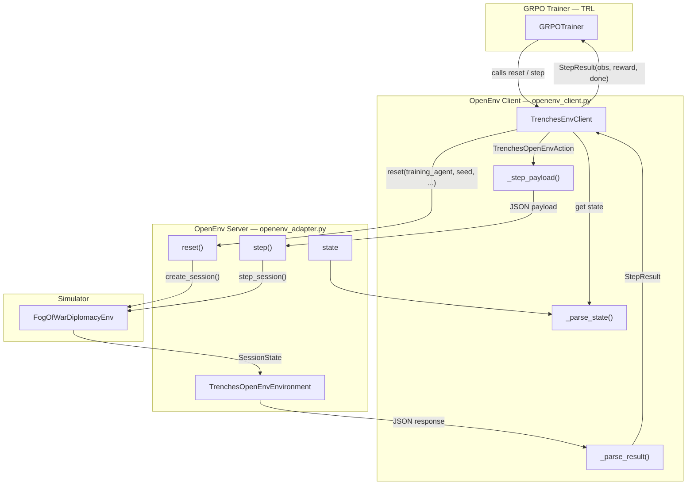

# OpenEnv Input / Output Flow

## Input: `TrenchesOpenEnvAction`

| Field                          | Type                     | Description                                                  |
| ------------------------------ | ------------------------ | ------------------------------------------------------------ |
| `action`                       | `AgentAction`            | Single-agent action (convenience for single-policy training) |
| `actions`                      | `dict[str, AgentAction]` | Joint actions keyed by agent ID                              |
| `prediction`                   | `Prediction`             | Single-agent prediction                                      |
| `predictions`                  | `dict[str, Prediction]`  | Joint predictions keyed by agent ID                          |
| `external_signals`             | `list[ExternalSignal]`   | Live external data injected into the turn                    |
| `autofill_missing_with_policy` | `bool`                   | Auto-fill missing agents via policy inference                |
| `autofill_missing_with_hold`   | `bool`                   | Auto-fill missing agents with "hold" action                  |

## Output: `TrenchesOpenEnvObservation`

| Field                    | Type                              | Description                                                                 |
| ------------------------ | --------------------------------- | --------------------------------------------------------------------------- |
| `reward`                 | `float`                           | Scalar training reward for the focused agent                                |
| `done`                   | `bool`                            | Whether the episode has ended                                               |
| `session_id`             | `str`                             | Current session identifier                                                  |
| `training_agent`         | `str`                             | Which agent is being trained                                                |
| `turn`                   | `int`                             | Current turn number                                                         |
| `agent_observation`      | `AgentObservation`                | The training agent's observation                                            |
| `joint_observations`     | `dict[str, AgentObservation]`     | All agents' observations (if requested)                                     |
| `reward_breakdown`       | `RewardBreakdown`                 | Detailed reward components                                                  |
| `oversight`              | `OversightIntervention`           | Any oversight system interventions                                          |
| `historical_replay`      | `HistoricalReplayState`           | Replay state (ground truth hidden)                                          |
| `revealed_event`         | `HistoricalEvent`                 | The historical event revealed this turn                                     |
| `prediction_assessments` | `dict[str, PredictionAssessment]` | Accuracy of past predictions                                                |
| `done_reason`            | `str`                             | Why the episode ended (`tension_threshold`, `max_turns`, `replay_complete`) |

## State: `TrenchesOpenEnvState`

| Field               | Type                         | Description                       |
| ------------------- | ---------------------------- | --------------------------------- |
| `session_id`        | `str`                        | Session identifier                |
| `training_agent`    | `str`                        | Focused agent                     |
| `training_stage`    | `TrainingStage`              | Current training stage            |
| `max_turns`         | `int`                        | Episode length limit              |
| `live_enabled`      | `bool`                       | Whether live data ingestion is on |
| `reward_breakdowns` | `dict[str, RewardBreakdown]` | All agents' reward details        |
| `last_oversight`    | `OversightIntervention`      | Most recent oversight action      |
| `session`           | `SessionState`               | Full session snapshot             |
