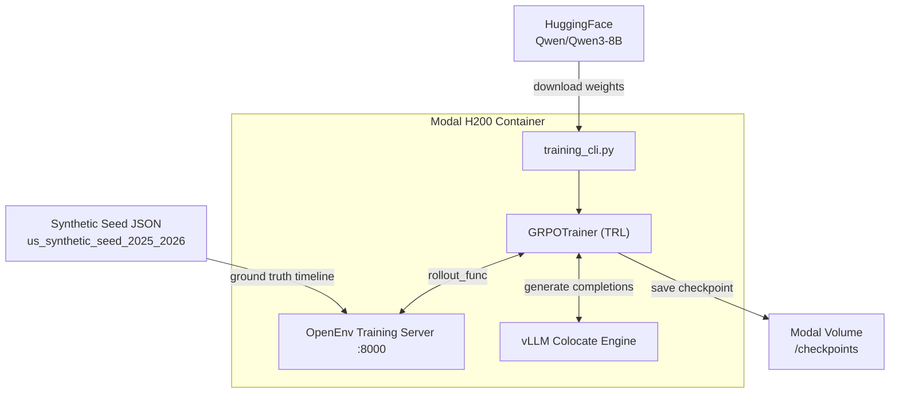
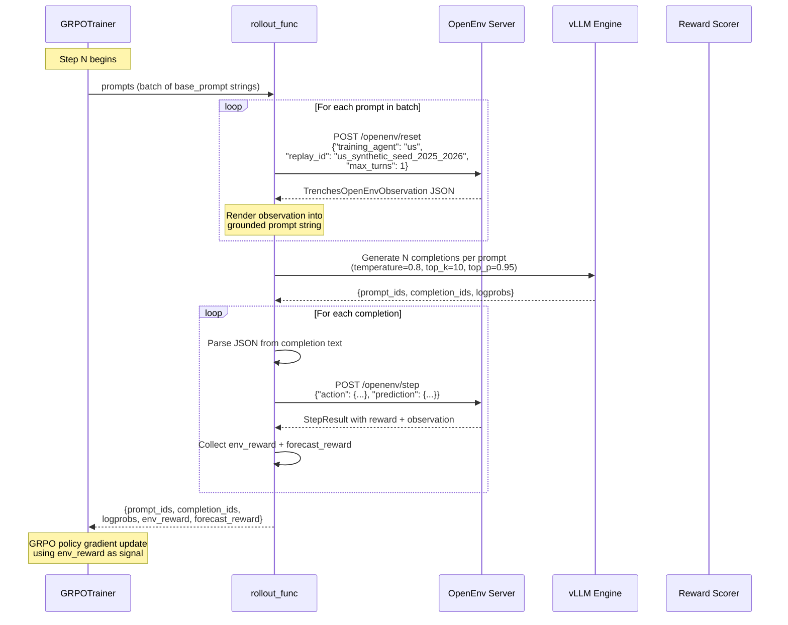
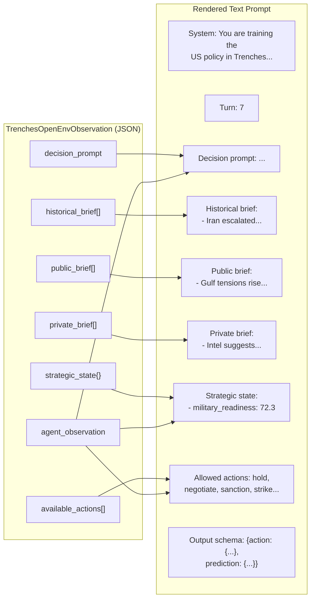
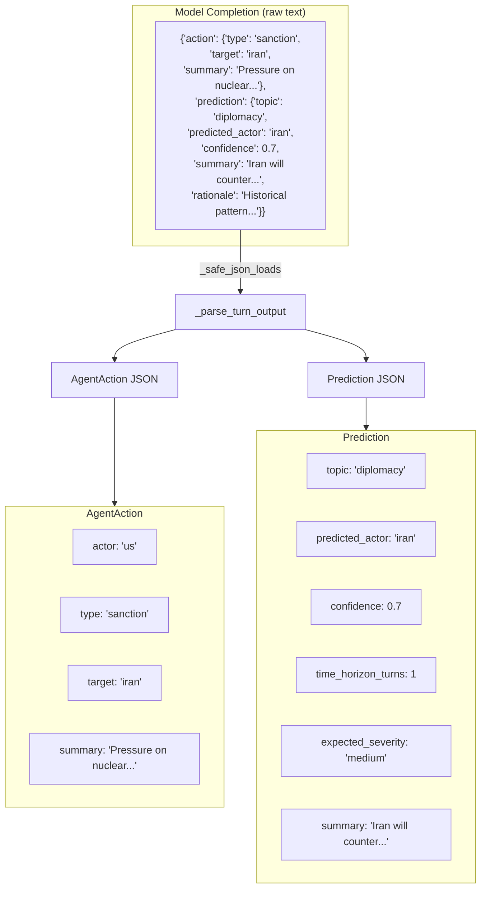
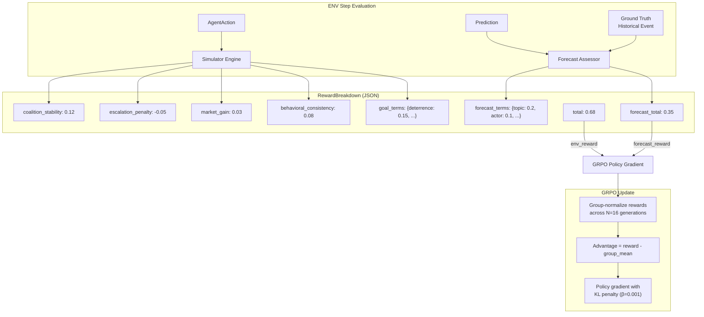

# Post-Training Data Flow: How JSON Drives GRPO Alignment

## 1. High-Level Pipeline



## 2. Single Rollout Step (The Core Loop)

This is the heart of post-training. Each GRPO step runs this loop for every prompt in the batch:



## 3. Observation → Prompt Rendering

The raw JSON observation is flattened into a structured text prompt for the model:



## 4. Model Output → Action + Prediction (JSON Parsing)



## 5. Reward Computation → GRPO Signal

The env returns a `RewardBreakdown` JSON that becomes the scalar reward for GRPO:



## 6. Full JSON Data Lifecycle

```mermaid
flowchart TB
    SEED["Synthetic Seed JSON<br/>(historical events timeline)"] -->|loaded at reset| ENV_STATE["SessionState"]

    ENV_STATE -->|fog-of-war filtered| OBS_JSON["AgentObservation JSON<br/>(public/private briefs,<br/>strategic state, actions)"]

    OBS_JSON -->|rendered to text| PROMPT["Grounded Prompt String"]

    PROMPT -->|tokenized| TOKENS["Token IDs"]

    TOKENS -->|vLLM inference| COMPLETION["Raw Completion Tokens"]

    COMPLETION -->|detokenized| TEXT["Completion Text"]

    TEXT -->|_safe_json_loads| PARSED["Parsed JSON<br/>{action: {...}, prediction: {...}}"]

    PARSED -->|validated + defaults| STRUCTS["AgentAction + Prediction<br/>(Pydantic models)"]

    STRUCTS -->|submitted to env| ENV_STEP["env.step()"]

    ENV_STEP -->|simulator + forecast assessor| REWARD_JSON["RewardBreakdown JSON<br/>{total: 0.68, forecast_total: 0.35, ...}"]

    REWARD_JSON -->|scalar reward.total| GRPO["GRPO Policy Gradient<br/>(group-relative advantage)"]

    GRPO -->|weight update| MODEL["Updated Qwen3-8B Weights"]

    MODEL -->|next rollout step| TOKENS

    style SEED fill:#2d4a2d,stroke:#4caf50
    style REWARD_JSON fill:#4a2d2d,stroke:#f44336
    style MODEL fill:#2d2d4a,stroke:#2196f3
```



---

## 7. Reward Scoring — Detailed Breakdown

The `RewardBreakdown.total` scalar that drives GRPO is the sum of two channels: **action reward** and **forecast reward**.

> Source: [`rl.py`](src/trenches_env/rl.py) (weights, impacts, doctrine) and [`env.py`](src/trenches_env/env.py) (`_compute_rewards`, `_score_prediction`)

### 7.1 Action Reward — "Did your action help your entity?"

Each entity has **4 strategic metrics** with a target value, tolerance band, and weight. The action reward measures how close each metric is to its target after applying the action's effects.

#### Entity Metric Targets

| Entity        | Metric                  | Target | Tolerance | Weight |
| ------------- | ----------------------- | ------ | --------- | ------ |
| **us**        | regional_access         | 82.0   | 18.0      | 0.29   |
|               | shipping_security       | 84.0   | 16.0      | 0.27   |
|               | domestic_support        | 68.0   | 18.0      | 0.20   |
|               | force_posture           | 80.0   | 16.0      | 0.14   |
| **israel**    | homeland_security       | 84.0   | 16.0      | 0.31   |
|               | northern_deterrence     | 78.0   | 18.0      | 0.28   |
|               | us_resupply_confidence  | 80.0   | 18.0      | 0.19   |
|               | reserve_endurance       | 68.0   | 18.0      | 0.12   |
| **iran**      | regime_stability        | 78.0   | 18.0      | 0.30   |
|               | proxy_corridor          | 76.0   | 18.0      | 0.24   |
|               | hormuz_leverage         | 72.0   | 14.0      | 0.23   |
|               | deterrence_credibility  | 74.0   | 18.0      | 0.13   |
| **hezbollah** | launch_survivability    | 72.0   | 18.0      | 0.27   |
|               | logistics_depth         | 70.0   | 18.0      | 0.22   |
|               | resistance_credibility  | 74.0   | 18.0      | 0.24   |
|               | political_cover         | 60.0   | 18.0      | 0.17   |
| **gulf**      | shipping_continuity     | 86.0   | 14.0      | 0.30   |
|               | investor_confidence     | 82.0   | 16.0      | 0.25   |
|               | infrastructure_security | 82.0   | 16.0      | 0.20   |
|               | diplomatic_flexibility  | 74.0   | 18.0      | 0.15   |
| **oversight** | runaway_risk            | 18.0   | 18.0      | 0.32   |
|               | autonomy_balance        | 76.0   | 16.0      | 0.22   |
|               | intervention_legitimacy | 74.0   | 18.0      | 0.20   |
|               | trace_clarity           | 78.0   | 16.0      | 0.16   |

#### Action Effects on Metrics (US example)

Each action type shifts the entity's metrics by hardcoded deltas:

| Action      | regional_access | shipping_security | domestic_support | force_posture |
| ----------- | --------------- | ----------------- | ---------------- | ------------- |
| hold        | —               | —                 | +0.8             | +0.6          |
| negotiate   | +4.2            | +1.6              | +1.4             | —             |
| sanction    | +1.0            | **-1.8**          | +0.5             | —             |
| strike      | **-2.2**        | **-3.1**          | **-4.0**         | **-1.2**      |
| defend      | —               | +3.4              | +0.7             | +4.2          |
| intel_query | +0.5            | —                 | —                | +1.2          |
| mobilize    | +1.1            | **-1.2**          | **-2.4**         | +3.0          |
| deceive     | **-1.1**        | —                 | **-2.2**         | —             |

#### Doctrinal Alignment Bonus

Each entity has preferred actions. The behavioral consistency score blends the entity's running consistency (60%) with a doctrinal fit score (40%):

| Action           | US       | Israel   | Iran     | Hezbollah | Gulf     | Oversight |
| ---------------- | -------- | -------- | -------- | --------- | -------- | --------- |
| negotiate        | **0.80** | 0.20     | -0.15    | -0.40     | **0.88** | 0.65      |
| defend           | **0.70** | **0.82** | 0.22     | 0.25      | **0.68** | 0.55      |
| strike           | -0.20    | **0.72** | 0.40     | **0.62**  | -0.45    | **-1.00** |
| deceive          | -0.15    | 0.10     | **0.82** | **0.86**  | -0.15    | -0.95     |
| oversight_review | -0.40    | -0.40    | -0.40    | -0.40     | -0.40    | **0.95**  |

#### Action Reward Formula

```
metric_score = clamp(1.0 - |current_value - target| / tolerance, -1, 1)

total = Σ(weight[i] × metric_score[i]) + 0.10 × behavior + 0.08 × action_response
        ─────────────────────────────────────────────────────────────────────────────
                              Σ(weights) + 0.10 + 0.08
```

### 7.2 Forecast Reward — "Did your prediction match the next real event?"

The model's `Prediction` JSON is compared against the next `HistoricalEvent` in the ground truth timeline.

#### Scoring Components

| Component       | Weight | Exact Match                                       | Wrong                    | Null/Missing |
| --------------- | ------ | ------------------------------------------------- | ------------------------ | ------------ | --- | --- |
| **Topic**       | 0.28   | +1.0                                              | -0.4                     | —            |
| **Actor**       | 0.18   | +1.0                                              | -0.5                     | -0.2         |
| **Target**      | 0.14   | +1.0                                              | -0.45                    | -0.15        |
| **Timing**      | 0.12   | `1.0 -                                            | horizon - 1              | × 0.6`       | —   | —   |
| **Severity**    | 0.16   | +1.0 (exact) / +0.35 (±1) / -0.2 (±2) / -0.5 (±3) | —                        | —            |
| **Calibration** | 0.12   | `1.0 -                                            | confidence - correctness | × 2.0`       | —   | —   |

#### Penalties

| Penalty             | Condition                                       | Value |
| ------------------- | ----------------------------------------------- | ----- |
| **Vague**           | No actor AND no target specified                | -0.18 |
| **Short summary**   | Summary < 24 chars                              | -0.12 |
| **Contradiction**   | Wrong topic + wrong actor but confidence ≥ 0.55 | -0.22 |
| **Confident false** | Correctness < 0.25 but confidence ≥ 0.70        | -0.32 |

#### Forecast Score Formula

```
forecast_total = clamp(
    0.28 × topic + 0.18 × actor + 0.14 × target + 0.12 × timing
  + 0.16 × severity + 0.12 × calibration
  + vague_penalty + contradiction_penalty + confident_false_penalty,
  -1.0, 1.0
)
```

### 7.3 Combined Reward → GRPO

```
final_reward = clamp(action_reward + FORECAST_REWARD_BLEND × forecast_total, -1, 1)
```

GRPO then group-normalizes across 16 generations per prompt:

```
advantage[i] = reward[i] - mean(rewards)
policy_loss  = -Σ advantage[i] × log_prob[i]  +  β × KL(policy ‖ reference)
```

Where `β = 0.001`. Completions scoring above the group mean get reinforced; those below get suppressed.
