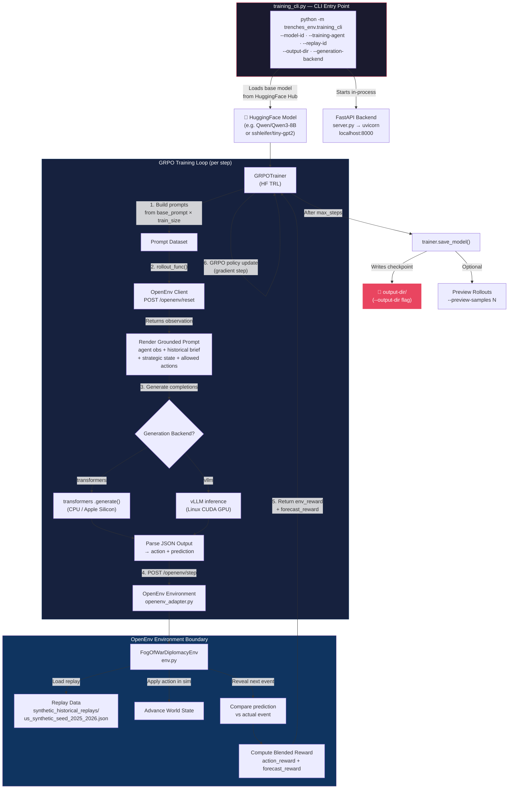
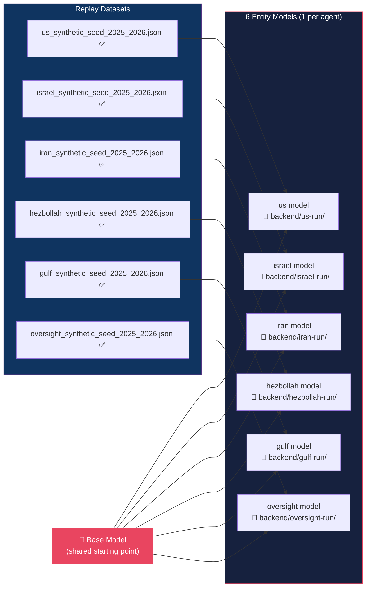
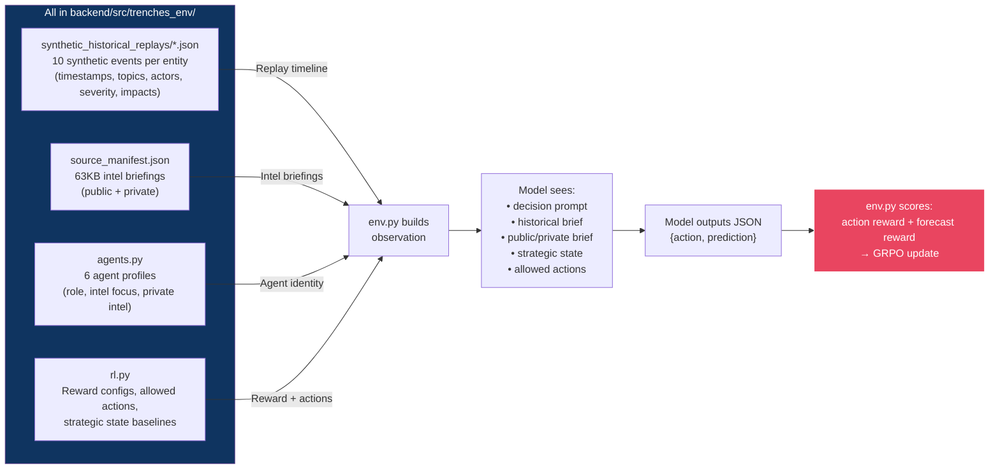
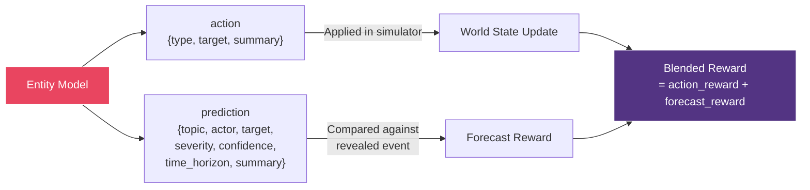

# Trenches OpenEnv Training Flow

## End-to-End Training Pipeline



## Model Storage Locations

| What                              | Where                                                    | Notes                                                                                                                                                                  |
| --------------------------------- | -------------------------------------------------------- | ---------------------------------------------------------------------------------------------------------------------------------------------------------------------- |
| **Base model (source)**           | HuggingFace Hub or a local checkpoint directory          | Loaded at training start via `AutoTokenizer.from_pretrained(model_id)` + `GRPOTrainer(model=model_id)`                                                                 |
| **HF cache (downloaded weights)** | `~/.cache/huggingface/hub/`                              | Automatic HF cache, reused across runs                                                                                                                                 |
| **Trained checkpoint (output)**   | `--output-dir` flag                                      | Default: `trl-openenv-historical-replay/`. Examples: `backend/tmp-training-run/`, `backend/us-qwen-replay-run/`, `backend/us-vllm-replay-run/`                         |
| **Replay dataset**                | `backend/src/trenches_env/synthetic_historical_replays/` | Bundled JSON files (e.g. `us_synthetic_seed_2025_2026.json`). ⚠️ **All 6 replays are currently synthetic seed data** — replace with curated truth sets for production. |

## Per-Entity Model Pattern



> ✅ = implemented (all 6 replays are **synthetic seed data** for smoke-testing — replace with curated truth sets for production)

The first collection step for replacing those seeds is now:

```bash
python -m trenches_env.historical_collection_cli --training-agent us --window 2025 --window 2026
```

That collector writes replay JSON in the same schema as the bundled seed files plus raw article audit JSONL for review.

Saved output directories are reusable as future `--model-id` inputs and can be served with standard Hugging Face-compatible deployment tooling.

## Data Sources During Post-Training

All data is bundled in the repo. No external API calls during post-training.



## Dual-Output Per Step

Each training step requires the model to produce **two outputs**:


